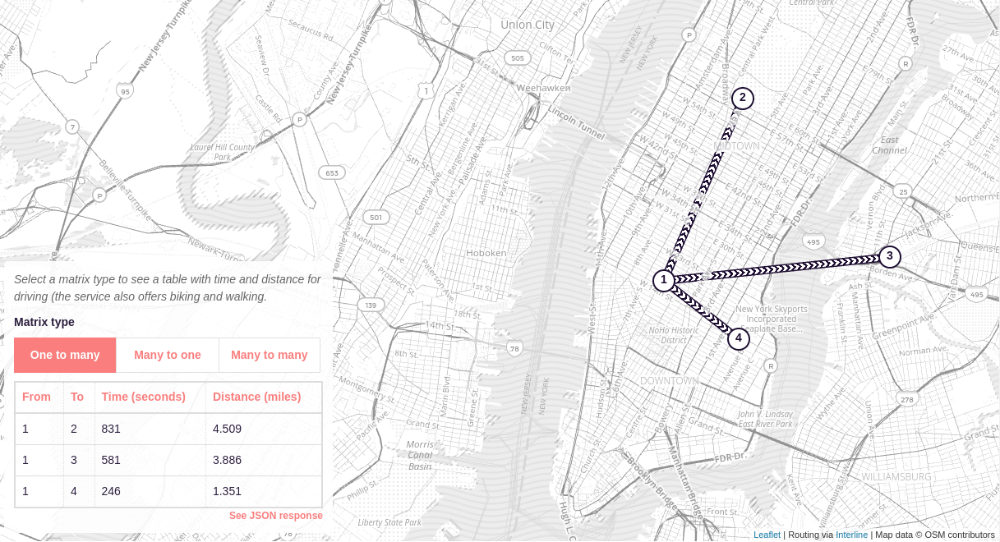
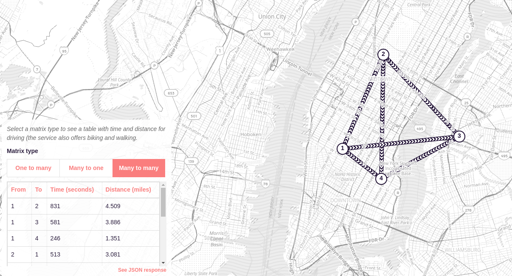

# Time-Distance Matrix service API reference

Valhalla's time-distance matrix service provides a quick computation of time and distance between a set of locations and returns them to you in the resulting matrix table.



## Matrix service

The time distance matrix service takes a `sources` and `targets` to list locations. This allows you to set the source (origin) locations separately from the target (destination) locations. The set of origins may be disjoint (not overlapping) with the set of destinations. In other words, the target locations do not have to include any locations from source locations. The time-distance matrix can return a row matrix, a column matrix, or a general matrix of computed time and distance, depending on your input for the sources and targets parameters. The general case is a row ordered matrix with the time and distance from each source location to each target location. A row vector is considered a *one_to_many* time-distance matrix where there is one source location and multiple target locations. The time and distance from the source location to all target locations is returned. A column matrix represents a *many_to_one* time-distance matrix where there are many sources and one target. Another special case is when the source location list is the same as the target location list. Here, a diagonal (square matrix with [0,0.00] on the diagonal elements) matrix is returned. The is special case is often used as the input to optimized routing problems.

## Inputs of the matrix service

The matrix request run locally takes the form of `localhost:8002/sources_to_targets?json={}`, where the JSON inputs inside the `{}` includes at least one location for both sources and for targets as well as the route costing type and options for the route costing model.


For example, while at your office, you want to know the times and distances to walk to several restaurants where you could have dinner, as well as the times and distances from each restaurant to the train station for your commute home. This will help you determine where to eat. 

`one-to-many using /sources_to_targets?`

```json
{"sources":[{"lat":40.744014,"lon":-73.990508}],"targets":[{"lat":40.744014,"lon":-73.990508},{"lat":40.739735,"lon":-73.979713},{"lat":40.752522,"lon":-73.985015},{"lat":40.750117,"lon":-73.983704},{"lat":40.750552,"lon":-73.993519}],"costing":"pedestrian"}
```

`many-to-one using /sources_to_targets?`

```json
{"sources":[{"lat":40.744014,"lon":-73.990508},{"lat":40.739735,"lon":-73.979713},{"lat":40.752522,"lon":-73.985015},{"lat":40.750117,"lon":-73.983704},{"lat":40.750552,"lon":-73.993519}],"targets":[{"lat":40.750552,"lon":-73.993519}],"costing":"pedestrian"}
```

`many-to-many using /sources_to_targets?`

```json
{"sources":[{"lat":40.744014,"lon":-73.990508},{"lat":40.739735,"lon":-73.979713},{"lat":40.752522,"lon":-73.985015},{"lat":40.750117,"lon":-73.983704},{"lat":40.750552,"lon":-73.993519}],"targets":[{"lat":40.744014,"lon":-73.990508},{"lat":40.739735,"lon":-73.979713},{"lat":40.752522,"lon":-73.985015},{"lat":40.750117,"lon":-73.983704},{"lat":40.750552,"lon":-73.993519}],"costing":"pedestrian"}
```

### Source and target parameters

When using the `sources_to_targets` action, you specify sources and targets as ordered lists of one or more locations within a JSON array, depending on the type of matrix result you are expecting.

A source and target must include a latitude and longitude in decimal degrees. The coordinates can come from many input sources, such as a GPS location, a point or a click on a map, a geocoding service, and so on.

<details>
  <summary>Source and target parameters description</summary>

| Source and target parameters | Description |
| :--------- | :----------- |
| `lat` | Latitude of the source/target in degrees. |
| `lon` | Longitude of the source/target in degrees. |
| `date_time` | Expected date/time for the user to be at the location using the ISO 8601 format (YYYY-MM-DDThh:mm) in the local time zone of departure or arrival. `date_time` as location input offers more granularity over setting time than the global `date_time` object (see below). 

</details>

You can refer to the [route location documentation](./turn-by-turn/api-reference.md#locations) for more information on specifying locations.  

**Note**: `date_time` strings behave differently for `sources_to_targets` than for `route`. If set on the `sources` **and** there's more `targets` than `sources`, it'll behave like a "Specified departure time" on the `sources`. If set on the `targets` **and** there's less `targets` than `sources`, it'll behave like a "Specified arrival time" on the `targets`.

Also, using `type` in addition to the `lat` and `lon` within the location parameter has no meaning for matrices.

### Costing parameters

The Time-Distance Matrix service uses the `auto`, `bicycle`, `pedestrian` and `bikeshare` and other costing models available in the route service. Exception: **multimodal costing is not supported** for the time-distance matrix service at this time.  Refer to the [route costing models](./turn-by-turn/api-reference.md#costing-models) and [costing options](./turn-by-turn/api-reference.md#costing-options) documentation for more on how to specify this input.

### Other request options

<details>
  <summary>Options with description</summary>

| Options | Description |
| :------------------ | :----------- |
| `id` | Name your matrix request. If `id` is specified, the naming will be sent thru to the response. |
| `matrix_locations` | For one-to-many or many-to-one requests this specifies the minimum number of locations that satisfy the request. However, when specified, this option allows a partial result to be returned. This is basically equivalent to "find the closest/best `matrix_locations` locations out of the full location set". |
| `date_time` | This is the local date and time at the location.<ul><li>`type`<ul><li>0 - Current departure time.</li><li>1 - Specified departure time</li><li>2 - Specified arrival time.</li></ul></li><li>`value` - the date and time is specified in ISO 8601 format (YYYY-MM-DDThh:mm) in the local time zone of departure or arrival.  For example "2016-07-03T08:06"</li></ul><br></br>|
| `verbose`   | If `true` it will output a flat list of objects for `distances` & `durations` explicitly specifying the source & target indices. If `false` will return more compact, nested row-major `distances` & `durations` arrays and not echo `sources` and `targets`. Default `true`. |

</details>

### Time-dependent matrices

Most control can be achieved when setting a `date_time` string on each source or target. When setting the global `date_time` object as a shortcut instead, Valhalla will translate that to setting the `date_time.value` on all source locations when `date_time.type = 0/1` and on all target locations when `date_time.type = 2`.

However, there are important limitations of the `/sources_to_targets` service's time awareness. Due to algorithmic complexity, we disallow time-dependence for certain combinations of `date_time` on locations, if
- `date_time.type = 0/1` or `date_time` on any source, when there's more sources than targets
- `date_time.type = 2` or `date_time` on any target, when there's more or equal amount of targets than/as sources

## Outputs of the matrix service

If a matrix request has been named using the optional `&id=` input, then the name will be returned as a string `id`.

These are the results of a request to the Time-Distance Matrix service.

<details>
  <summary>Item description</summary>

| Item | Description |
| :---- | :----------- |
| `sources_to_targets` | Returns an array of time and distance between the sources and the targets. The array is **row-ordered**. This means that the time and distance from the first location to all others forms the first row of the array, followed by the time and distance from the second source location to all target locations, etc. |
| `distance` | The computed distance between each set of points. Distance will always be 0.00 for the first element of the time-distance array for `one_to_many`, the last element in a `many_to_one`, and the first and last elements of a `many_to_many`. |
| `time` | The computed time between each set of points. Time will always be 0 for the first element of the time-distance array for `one_to_many`, the last element in a `many_to_one`, and the first and last elements of a `many_to_many`.  |
| `to_index` | The destination index into the locations array. |
| `from_index` | The origin index into the locations array. |
| `date_time`  | (optional) If the date_time was valid for an origin, `date_time` will return the local time at the destination. |
| `locations` | The specified array of lat/lngs from the input request.
| `units` | Distance units for output. Allowable unit types are mi (miles) and km (kilometers). If no unit type is specified, the units default to kilometers. |
| `warnings` (optional) | This array may contain warning objects informing about deprecated request parameters, clamped values etc. | 

</details>

See the [HTTP return codes](./turn-by-turn/api-reference.md#http-status-codes-and-conditions) for more on messages you might receive from the service.

## Examples

#### 'One To Many' request:

```json
<VALHALLA BASE URL>/sources_to_targets?json={"sources":[{"lon":-73.995323,"lat":40.738804}],"targets":[{"lon":-73.978844,"lat":40.767673},{"lon":-73.948112,"lat":40.742577},{"lon":-73.979706,"lat":40.729568}],"costing":"auto","units":"mi"}`
```

<details>
  <summary>Lookup 'One To Many' Results in JSON Format</summary>

```xml title="Lookup Results in JSON Format"
{
  "algorithm": "costmatrix",
  "units": "miles",
  "sources": [
      [
          {
              "lon": -73.995323,
              "lat": 40.738804
          }
      ]
  ],
  "targets": [
      [
          {
              "lon": -73.978844,
              "lat": 40.767673
          },
          {
              "lon": -73.948112,
              "lat": 40.742577
          },
          {
              "lon": -73.979706,
              "lat": 40.729568
          }
      ]
  ],
  "sources_to_targets": [
      [
          {
              "distance": 4.509,
              "time": 831,
              "to_index": 0,
              "from_index": 0
          },
          {
              "distance": 3.886,
              "time": 581,
              "to_index": 1,
              "from_index": 0
          },
          {
              "distance": 1.351,
              "time": 246,
              "to_index": 2,
              "from_index": 0
          }
      ]
  ]
}
```
</details>

#### 'Many To Many' request:

```json
<VALHALLA BASE URL>/sources_to_targets?json={"sources":[{"lon":-73.995323,"lat":40.738804},{"lon":-73.978844,"lat":40.767673},{"lon":-73.948112,"lat":40.742577},{"lon":-73.979706,"lat":40.729568}],"targets":[{"lon":-73.995323,"lat":40.738804},{"lon":-73.978844,"lat":40.767673},{"lon":-73.948112,"lat":40.742577},{"lon":-73.979706,"lat":40.729568}],"costing":"auto","units":"mi"}`
```

<details>
  <summary>Lookup 'Many To Many' Results in JSON Format</summary>

```xml title="Lookup Results in JSON Format"
{
  "algorithm": "costmatrix",
  "units": "miles",
  "sources": [
      [
          {
              "lon": -73.995323,
              "lat": 40.738804
          },
          {
              "lon": -73.978844,
              "lat": 40.767673
          },
          {
              "lon": -73.948112,
              "lat": 40.742577
          },
          {
              "lon": -73.979706,
              "lat": 40.729568
          }
      ]
  ],
  "targets": [
      [
          {
              "lon": -73.995323,
              "lat": 40.738804
          },
          {
              "lon": -73.978844,
              "lat": 40.767673
          },
          {
              "lon": -73.948112,
              "lat": 40.742577
          },
          {
              "lon": -73.979706,
              "lat": 40.729568
          }
      ]
  ],
  "sources_to_targets": [
      [
          {
              "distance": 0.000,
              "time": 0,
              "to_index": 0,
              "from_index": 0
          },
          {
              "distance": 4.509,
              "time": 831,
              "to_index": 1,
              "from_index": 0
          },
          {
              "distance": 3.886,
              "time": 581,
              "to_index": 2,
              "from_index": 0
          },
          {
              "distance": 1.351,
              "time": 246,
              "to_index": 3,
              "from_index": 0
          }
      ],
      [
          {
              "distance": 3.081,
              "time": 513,
              "to_index": 0,
              "from_index": 1
          },
          {
              "distance": 0.000,
              "time": 0,
              "to_index": 1,
              "from_index": 1
          },
          {
              "distance": 3.345,
              "time": 422,
              "to_index": 2,
              "from_index": 1
          },
          {
              "distance": 3.795,
              "time": 587,
              "to_index": 3,
              "from_index": 1
          }
      ],
      [
          {
              "distance": 3.572,
              "time": 514,
              "to_index": 0,
              "from_index": 2
          },
          {
              "distance": 4.498,
              "time": 666,
              "to_index": 1,
              "from_index": 2
          },
          {
              "distance": 0.000,
              "time": 0,
              "to_index": 2,
              "from_index": 2
          },
          {
              "distance": 3.467,
              "time": 487,
              "to_index": 3,
              "from_index": 2
          }
      ],
      [
          {
              "distance": 1.338,
              "time": 252,
              "to_index": 0,
              "from_index": 3
          },
          {
              "distance": 4.593,
              "time": 820,
              "to_index": 1,
              "from_index": 3
          },
          {
              "distance": 3.087,
              "time": 436,
              "to_index": 2,
              "from_index": 3
          },
          {
              "distance": 0.000,
              "time": 0,
              "to_index": 3,
              "from_index": 3
          }
      ]
    ]
}
```
</details>

