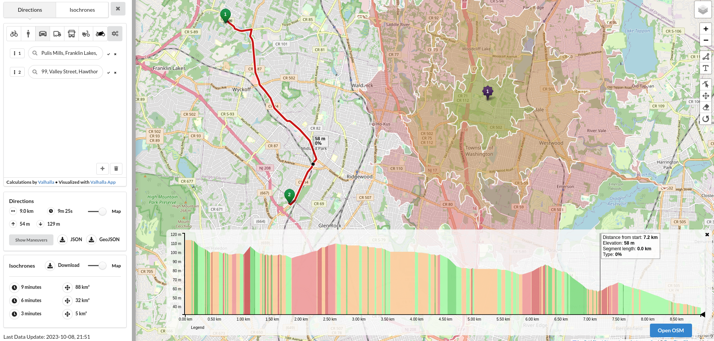

# Valhalla 🧭

Valhalla is an open source routing engine and accompanying libraries for use with OpenStreetMap data. Valhalla also includes tools like time+distance matrix computation, isochrones, elevation sampling, map matching and tour optimization (Travelling Salesman).

  
Terminology

* `break location` - the start or end point of a route.
* `cost` - fixed costs in seconds that are added to both the path cost and the estimated time.
* `costing model` - set of costs for particular methods of travel, such as automobile or pedestrian.
* `edge` - a line connected between nodes
* `factor` - multiply the cost along an edge or road section in a way that influences the path to favor or avoid a particular attribute
* `graph` - a set of edges connected by nodes used for building a route
* `location` - a latitude, longitude coordinate pair, specified in decimal degrees that determines the routing and order of navigation.
* `maneuver` - an operation to be performed during navigation, such as a turn, and the expected duration of the movement.
* `narration` - textual guidance describing the maneuver to be performed, such as a turn, distance to travel, and expected time.
* `path` - the sequence of edges forming a route
* `penalty` - fixed costs in seconds that are only added to the path cost. Penalties can influence the route path determination but do not add to the estimated time along the path.
* `route` - sequence of edges and maneuvers forming the best travel path between locations given the available road network, costs, influence factors, and other inputs.
* `short path` - a route that attempts to minimize distance traveled over the constituent edges, but may not be the shortest distance.
* `through location` - an optional location to influence the route to travel through that location.
* `tiled routing` - method of building a path on graph data that has been split into square cells.
* `time` - the number of seconds estimated to complete a maneuver or trip, including any additional costs.
* `trip` - results of an entire route, including locations, legs, and maneuvers.
* height - with respect to elevation, the height above or below sea level at a specific location (lat,lng).
* `height with range` - computing the range (cumulative distance) and height for a series of lat,lng pairs of a line or shape. This is very useful for charting/graphing.

## Features
1. Flexible routing methods with dynamic costing - allowing multiple route types with the same data.
2. Expanded guidance / route narrative information providing clear and concise instructions along the route as well as output tailored for navigation along the route.
3. Tiled routing data structure allowing use within small memory profiles including mobile devices.
4. Includes software to import and create routing tiles from OpenStreetMap pbf data: from small extracts to worldwide coverage.
5. Includes turn restrictions, highway exit information, administrative information, and timezones.

## How to use

**Valhalla API has the following endpoints for querying the data:**

* __[route](/docs/MapColonies/openstreetmap/valhalla/turn-by-turn/osm-valhalla-route)__ - the service guides you between points by car, bike, foot, and multimodal combinations involving walking and riding public transit.
* __[optimized-route](/docs/MapColonies/openstreetmap/valhalla/osm-valhalla-optimized-route)__ - computes the times and distances between many origins and destinations and provides you with an optimized path between the locations.
* __[matrix](/docs/MapColonies/openstreetmap/valhalla/osm-valhalla-matrix)__ - if you want only a table of the times and distances, start with the matrix service.
* __[isochrone](/docs/MapColonies/openstreetmap/valhalla/osm-valhalla-isochrone)__ - get a computation of areas that are reachable within specified time periods from a location or set of locations.
* __[expansion](/docs/MapColonies/openstreetmap/valhalla/osm-valhalla-expansion)__ - return a geojson representation of a graph traversal at a given location.
* __[locate](/docs/MapColonies/openstreetmap/valhalla/osm-valhalla-locate)__ - get detailed metadata about the nodes and edges in the graph.

> 📝 **_Note:_** 
Valhalla is an open-source toolkit for multimodal transportation, powered by open data. The APIs use the standard REST model of interaction with JSON serving as both the request and response formats. Please refer to a specific service's API documentation to learn about the various request/response properties. In addition to JSON request/response formats Valhalla also supports protocol buffers as request/response format.